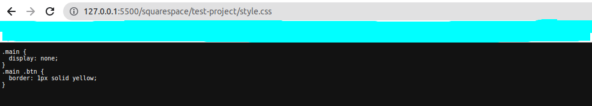

# IDE settings

- ### 1. Download and Install Vscode [link](https://code.visualstudio.com/)
- ### 2. Install "Live Server" extension

    
    

- ### Install "Live Sass Compiler" extension

    
    ##### ```liveSassCompile.settings.generateMap:``` Set it as ```false``` if you don't want .map file for compiled CSS.
    > "liveSassCompile.settings.generateMap": false
    
    
    
    ##### Add this property
    > "liveSassCompile.settings.generateMap": false
    

---
#  Work On The Project

- #### 1. In the project folder, create a styles file
    >example: style.scss
    

- #### 2. Run "Watch Sass"
    

- #### 3. It compiles scss to css
    

- #### 4. Start the Live Server
    

- #### 4. In the browser window that opens, select your ```css``` file
    

- #### 4. Paste this link in the squarespace project
    